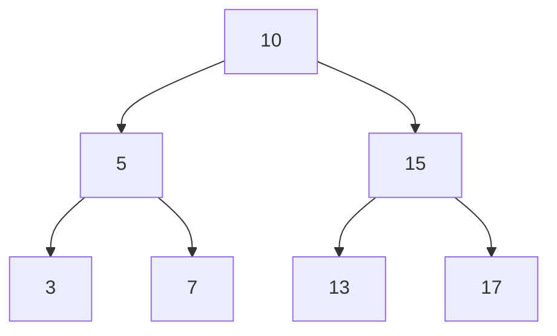
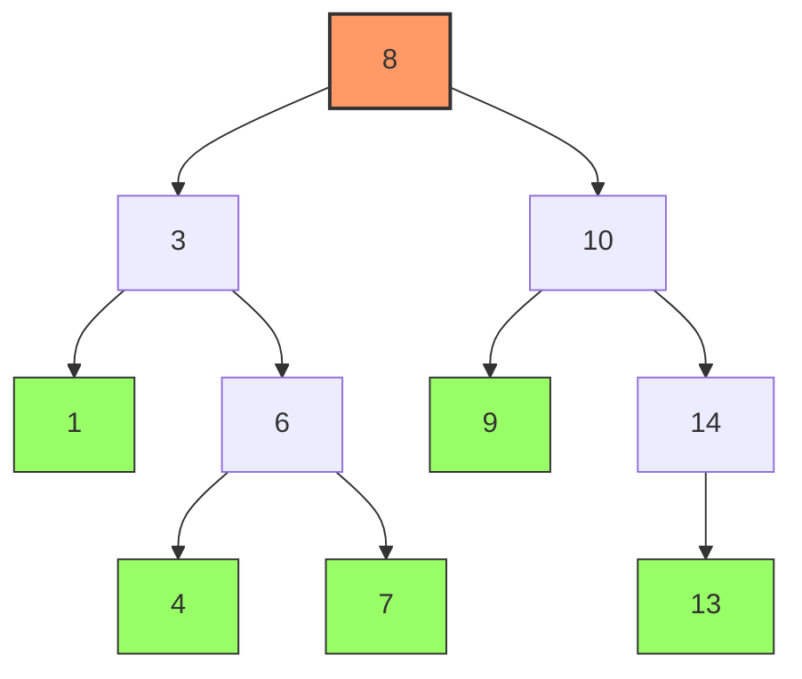

# binary search trees

## WTF is a Binary Search Tree (BST)?

* A Binary Search Tree is a binary tree data structure where each node has up to two children: a left and a right child
* It has the key property that for any node, all values in its left subtree are smaller and all values in its right subtree are larger than the node’s value
* This ordering allows efficient searching, insertion and deletion operations
* Balanced BSTs maintain height balance for optimal performance
* example...



## Why TF are BSTs important?

* BSTs are important because they allow dynamic data to be stored in sorted order, enabling quick lookup, insertion, and deletion with average time complexity of $$O(\log n)$$
* They form the basis for faster algorithms in databases, file systems, and real-time data processing where sorted data access is critical

## How TF do BSTs work?

* Operations work recursively:
- **Search**: Compare target with current node; go left if smaller, right if larger
- **Insertion**: Similar to search but insert at the null position found
- **Deletion**: More complex, involves re-linking nodes based on the number of children the node has
- **Traversal**: In-order traversal outputs sorted values

## Example Implementations in Python

### Example 1: Simple BST Node and Insert

```python
class Node:
    def __init__(self, key):
        self.left = None
        self.right = None
        self.value = key

def insert(root, key):
    if root is None:
        return Node(key)
    if key < root.value:
        root.left = insert(root.left, key)
    else:
        root.right = insert(root.right, key)
    return root

# Usage
root = Node(10)
insert(root, 5)
insert(root, 15)
```

### Example 2: Search and In-Order Traversal

```python
def search(root, key):
    if root is None or root.value == key:
        return root
    if key < root.value:
        return search(root.left, key)
    return search(root.right, key)

def inorder(root):
    if root:
        inorder(root.left)
        print(root.value, end=' ')
        inorder(root.right)

# Usage
inorder(root)  # Outputs 5 10 15
found = search(root, 15)
print(found.value if found else "Not found")
```

### Example 3: Deletion from BST

```python
def min_value_node(node):
    current = node
    while current.left is not None:
        current = current.left
    return current

def delete_node(root, key):
    if root is None:
        return root
    if key < root.value:
        root.left = delete_node(root.left, key)
    elif key > root.value:
        root.right = delete_node(root.right, key)
    else:
        if root.left is None:
            return root.right
        elif root.right is None:
            return root.left
        temp = min_value_node(root.right)
        root.value = temp.value
        root.right = delete_node(root.right, temp.value)
    return root

# Usage
root = delete_node(root, 10)
inorder(root)  # Should output 5 15
```

### Example 4: Balanced BST Concept (AVL Tree Basics)

* Balanced BSTs such as AVL trees ensure height difference between subtrees is at most 1, guaranteeing $$O(\log n)$$ operations
* They require rotations to maintain balance after insertion or deletion
* An AVL tree is a self-balancing binary search tree ensuring the height difference between left and right subtrees for any node is at most 1
* It performs rotations to maintain balance after insertions and deletions

```python
class TreeNode:
    def __init__(self, key):
        self.key = key
        self.left = None
        self.right = None
        self.height = 1

class AVLTree:
    def getHeight(self, node):
        if not node:
            return 0
        return node.height

    def getBalance(self, node):
        if not node:
            return 0
        return self.getHeight(node.left) - self.getHeight(node.right)

    def rightRotate(self, y):
        x = y.left
        T2 = x.right
        x.right = y
        y.left = T2
        
        y.height = 1 + max(self.getHeight(y.left), self.getHeight(y.right))
        x.height = 1 + max(self.getHeight(x.left), self.getHeight(x.right))

        return x

    def leftRotate(self, x):
        y = x.right
        T2 = y.left
        
        y.left = x
        x.right = T2
        
        x.height = 1 + max(self.getHeight(x.left), self.getHeight(x.right))
        y.height = 1 + max(self.getHeight(y.left), self.getHeight(y.right))
        
        return y

    def insert(self, node, key):
        if not node:
            return TreeNode(key)
        elif key < node.key:
            node.left = self.insert(node.left, key)
        else:
            node.right = self.insert(node.right, key)

        node.height = 1 + max(self.getHeight(node.left), self.getHeight(node.right))

        balance = self.getBalance(node)

        # Left Left
        if balance > 1 and key < node.left.key:
            return self.rightRotate(node)

        # Right Right
        if balance < -1 and key > node.right.key:
            return self.leftRotate(node)

        # Left Right
        if balance > 1 and key > node.left.key:
            node.left = self.leftRotate(node.left)
            return self.rightRotate(node)

        # Right Left
        if balance < -1 and key < node.right.key:
            node.right = self.rightRotate(node.right)
            return self.leftRotate(node)

        return node

    def minValueNode(self, node):
        current = node
        while current.left is not None:
            current = current.left
        return current

    def delete(self, root, key):
        if not root:
            return root

        if key < root.key:
            root.left = self.delete(root.left, key)
        elif key > root.key:
            root.right = self.delete(root.right, key)
        else:
            if not root.left:
                return root.right
            elif not root.right:
                return root.left

            temp = self.minValueNode(root.right)
            root.key = temp.key
            root.right = self.delete(root.right, temp.key)

        if root is None:
            return root

        root.height = 1 + max(self.getHeight(root.left), self.getHeight(root.right))

        balance = self.getBalance(root)

        # Left Left
        if balance > 1 and self.getBalance(root.left) >= 0:
            return self.rightRotate(root)

        # Left Right
        if balance > 1 and self.getBalance(root.left) < 0:
            root.left = self.leftRotate(root.left)
            return self.rightRotate(root)

        # Right Right
        if balance < -1 and self.getBalance(root.right) <= 0:
            return self.leftRotate(root)

        # Right Left
        if balance < -1 and self.getBalance(root.right) > 0:
            root.right = self.rightRotate(root.right)
            return self.leftRotate(root)

        return root

    def preOrder(self, root):
        if not root:
            return
        print(root.key, end=' ')
        self.preOrder(root.left)
        self.preOrder(root.right)

# Example usage:
avl = AVLTree()
root = None
for key in [10, 20, 30, 40, 50, 25]:
    root = avl.insert(root, key)

print("Preorder traversal after inserts:")
avl.preOrder(root)

root = avl.delete(root, 40)
print("\nPreorder traversal after deleting 40:")
avl.preOrder(root)
```

### Example 5. Balanced BST Concept (Red-Black Tree Implementation in Python)
* A Red-Black tree is another kind of self-balancing BST with an additional colour property (red or black) per node to maintain balancing during insertions and deletions

```python
class RBNode:
    def __init__(self, data):
        self.data = data
        self.parent = None
        self.left = None
        self.right = None
        self.color = 1  # 1 = Red, 0 = Black

class RedBlackTree:
    def __init__(self):
        self.TNULL = RBNode(0)
        self.TNULL.color = 0
        self.TNULL.left = None
        self.TNULL.right = None
        self.root = self.TNULL

    def preorder_helper(self, node):
        if node != self.TNULL:
            print(f'{node.data} {"R" if node.color else "B"}', end=' ')
            self.preorder_helper(node.left)
            self.preorder_helper(node.right)

    def search_tree_helper(self, node, key):
        if node == self.TNULL or key == node.data:
            return node
        if key < node.data:
            return self.search_tree_helper(node.left, key)
        return self.search_tree_helper(node.right, key)

    def left_rotate(self, x):
        y = x.right
        x.right = y.left
        if y.left != self.TNULL:
            y.left.parent = x

        y.parent = x.parent
        if x.parent == None:
            self.root = y
        elif x == x.parent.left:
            x.parent.left = y
        else:
            x.parent.right = y

        y.left = x
        x.parent = y

    def right_rotate(self, x):
        y = x.left
        x.left = y.right
        if y.right != self.TNULL:
            y.right.parent = x

        y.parent = x.parent
        if x.parent == None:
            self.root = y
        elif x == x.parent.right:
            x.parent.right = y
        else:
            x.parent.left = y

        y.right = x
        x.parent = y

    def insert_fixup(self, k):
        while k.parent and k.parent.color == 1:
            if k.parent == k.parent.parent.right:
                u = k.parent.parent.left
                if u.color == 1:
                    u.color = 0
                    k.parent.color = 0
                    k.parent.parent.color = 1
                    k = k.parent.parent
                else:
                    if k == k.parent.left:
                        k = k.parent
                        self.right_rotate(k)
                    k.parent.color = 0
                    k.parent.parent.color = 1
                    self.left_rotate(k.parent.parent)
            else:
                u = k.parent.parent.right
                if u.color == 1:
                    u.color = 0
                    k.parent.color = 0
                    k.parent.parent.color = 1
                    k = k.parent.parent
                else:
                    if k == k.parent.right:
                        k = k.parent
                        self.left_rotate(k)
                    k.parent.color = 0
                    k.parent.parent.color = 1
                    self.right_rotate(k.parent.parent)
            if k == self.root:
                break
        self.root.color = 0

    def insert(self, key):
        node = RBNode(key)
        node.parent = None
        node.left = self.TNULL
        node.right = self.TNULL
        node.color = 1

        y = None
        x = self.root

        while x != self.TNULL:
            y = x
            if node.data < x.data:
                x = x.left
            else:
                x = x.right

        node.parent = y
        if y == None:
            self.root = node
        elif node.data < y.data:
            y.left = node
        else:
            y.right = node

        if node.parent == None:
            node.color = 0
            return

        if node.parent.parent == None:
            return

        self.insert_fixup(node)

    def transplant(self, u, v):
        if u.parent == None:
            self.root = v
        elif u == u.parent.left:
            u.parent.left = v
        else:
            u.parent.right = v
        v.parent = u.parent

    def minimum(self, node):
        while node.left != self.TNULL:
            node = node.left
        return node

    def delete_fixup(self, x):
        while x != self.root and x.color == 0:
            if x == x.parent.left:
                s = x.parent.right
                if s.color == 1:
                    s.color = 0
                    x.parent.color = 1
                    self.left_rotate(x.parent)
                    s = x.parent.right
                if s.left.color == 0 and s.right.color == 0:
                    s.color = 1
                    x = x.parent
                else:
                    if s.right.color == 0:
                        s.left.color = 0
                        s.color = 1
                        self.right_rotate(s)
                        s = x.parent.right
                    s.color = x.parent.color
                    x.parent.color = 0
                    s.right.color = 0
                    self.left_rotate(x.parent)
                    x = self.root
            else:
                s = x.parent.left
                if s.color == 1:
                    s.color = 0
                    x.parent.color = 1
                    self.right_rotate(x.parent)
                    s = x.parent.left
                if s.left.color == 0 and s.right.color == 0:
                    s.color = 1
                    x = x.parent
                else:
                    if s.left.color == 0:
                        s.right.color = 0
                        s.color = 1
                        self.left_rotate(s)
                        s = x.parent.left
                    s.color = x.parent.color
                    x.parent.color = 0
                    s.left.color = 0
                    self.right_rotate(x.parent)
                    x = self.root
        x.color = 0

    def delete_node_helper(self, node, key):
        z = self.TNULL
        while node != self.TNULL:
            if node.data == key:
                z = node

            if node.data <= key:
                node = node.right
            else:
                node = node.left

        if z == self.TNULL:
            print("Key not found in the tree")
            return

        y = z
        y_original_color = y.color
        if z.left == self.TNULL:
            x = z.right
            self.transplant(z, z.right)
        elif z.right == self.TNULL:
            x = z.left
            self.transplant(z, z.left)
        else:
            y = self.minimum(z.right)
            y_original_color = y.color
            x = y.right
            if y.parent == z:
                x.parent = y
            else:
                self.transplant(y, y.right)
                y.right = z.right
                y.right.parent = y

            self.transplant(z, y)
            y.left = z.left
            y.left.parent = y
            y.color = z.color

        if y_original_color == 0:
            self.delete_fixup(x)

    def delete(self, key):
        self.delete_node_helper(self.root, key)

    def preorder(self):
        self.preorder_helper(self.root)

# Example usage:
rbt = RedBlackTree()
for k in [10, 20, 30, 15, 25, 40]:
    rbt.insert(k)

print("\nRed-Black Tree preorder after inserts:")
rbt.preorder()

rbt.delete(20)
print("\nRed-Black Tree preorder after deleting 20:")
rbt.preorder()
```

* here is how the BST would look like...



## Summary

* Binary Search Trees organise sorted data with efficient insertion, search, and deletion
* They are foundational in computer science for dynamic sorted data applications
* Simple BSTs are easy to implement, whereas balanced BSTs require more complex logic but deliver performance guarantees
