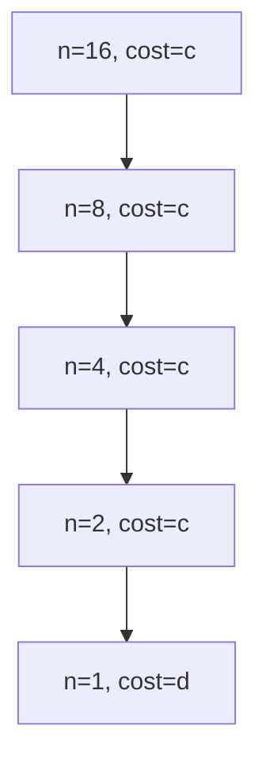
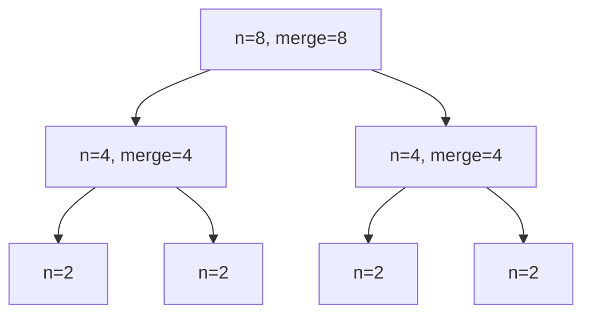

# divide and conquer (plus recurrence tree method)

## 0. algorithms
### 0.1. binary search pseudocode #1: recursion

```plaintext
BinarySearch(array, target, S, E):
    if S > E:
        return -1 ............................... line 3 ...... N/A .... c

    mid = (S + E) // 2 ......................... line 5 ...... n ...... c

    if array[mid] == target: .................... line 7 ...... n/2 .... c
        return mid
    else if array[mid] < target: ................ line 9 ...... n/4 .... c
        return BinarySearch(
            array, target, mid+1, E ............. line 11 ..... n/8 .... c
        )
    else:
        return BinarySearch(
            array, target, S, mid-1 ............. line 15 ..... 1 ...... c
        )
```

* `line X` is the line number on a code editor assuming the function definition starts at line one
* `n/X` is the subproblem size at that point in the algo
* `c` is the time it takes to address the work that is outside the recursion

### 0.2. Binary search pseudocode #2: iteration

```plaintext
BinarySearch(array, target):
    S = 0
    E = array.length - 1
    while S <= E:
        mid = (S + E) // 2
        if array[mid] == target:
            return mid
        else if array[mid] < target:
            S = mid + 1
        else:
            E = mid - 1
    return -1
```

## 1. definitions
### 1.1. divide and conquer
* a general algorithm design paradigm
    * **divide** the problem into sub-problems that are similar to the original but smaller in size
    * **conquer** the sub-problems by solving them recursively or in a straightforward manner if they are small enough 
    * **combine** the solutions of the sub-problems into the solution of the original problem
> **Divide and conquer is a paradigm not an algorithm**
### 1.2. recurrence relation
* a mathematical equation that defines a sequence of values based on its previous terms
    * example:  $F$, the standard Fibonacci sequence: $F : \{f_n = f_{n-1} + f_{n-2}\medspace where\medspace f_0 = 0,  f_1 = 1 \medspace and \medspace n \geq 2\}$
* describes how the time complexity of a problem is related to
    * size of input
    * complexities of the smaller sub-problems created during the algo's execution
* total time to solve a problem of size $n$ is expressed as
    * $T(n)$ = work done during recursive call plus work done in current step
    * example: $T(n) = T(\frac{n}{2}) + 1$
## 2. Binary search algorithm
### 2.1. recurrence relations
$ T(n) = T\left(\frac{n}{2}\right) + \Theta(c), \quad T(1) = d $

### 2.2. recurrence tree method

**example: n = 16**
```plaintext
level 0: 1 problem (size 16) → cost c
         ↓
level 1: 1 problem (size 8)  → cost c  
         ↓
level 2: 1 problem (size 4)  → cost c
         ↓
level 3: 1 problem (size 2)  → cost c
         ↓
level 4: 1 problem (size 1)  → cost d
```
Total cost = $4c + d \implies O(\log n)$

**visualisation (n=16):**



* **how TF do we get to $\Omicron(log N)$?**
    * glad you asked...
        * **question:** how many times can you divide $n$ until you get to 1?
            * $n, \frac{n}{2}, \frac{n}{4}, \frac{n}{8}, ..., 1$
            $$
                n, \frac{n}{2}, \frac{n}{4}, \frac{n}{8}, ..., 1 \\[1em]
                \frac{n}{2^0}, \frac{n}{2^1}, \frac{n}{2^2}, \frac{n}{2^3}, ..., \frac{2^k}{2^k} \\[1em]
            $$
            * we can see the following so far:
                * n must be 2<sup>k</sup> where $k$ is the number of times/steps/terms needed to get from n to 1
                * the powers of the denominator increase by one at each step: that is, $k = 0, 1, 2, ...$
        $$
            n = 2^k \\[1em]
            log_2 n = k log_2 2 \\[1em]
            \frac{log_2 n}{ log_2 2} = k \\[1em]
            \therefore k \approx log \medspace n
        $$
    * **answer:** k times where $k = log \medspace n$

* for a binary search algo, $T(n) \in \Omicron(log(n))$

## 3. merge sort algorithm
### 3.1. recurrence tree method

**Recurrence:** $ T(n) = 2T\left(\frac{n}{2}\right) + \Theta(n) $

**example: n = 8**
```
level 0: 1 × Θ(8)  = Θ(8)  [merge cost]
         ↓
level 1: 2 × Θ(4)  = Θ(8)  [merge cost] 
         ↓
level 2: 4 × Θ(2)  = Θ(8)  [merge cost]
         ↓
level 3: 8 × Θ(1)  = Θ(8)  [base case]
```
Total: $\Theta(8) \times 4 \implies \Theta(n \log n)$

**tree (n=8):**



### 3.2. master theorem
For $T(n) = 2T(n/2) + \Theta(n)$:
- $a=2, b=2, f(n)=\Theta(n)$
- $n^{\log_b a} = n^{\log_2 2} = n^1 = n$
- **case 2**: $f(n) = \Theta(n^{\log_b a} \log^k n)$ where $k=0$
- **result**: $T(n) = \Theta(n \log n)$

## 4. time-space trade-offs

### 4.1. binary search variants

| variant | time | space | trade-off |
|---------|------|-------|-----------|
| **recursive** | $O(\log n)$ | $O(\log n)$ stack | simple but stack overflow risk for huge n |
| **iterative** | $O(\log n)$ | $O(1)$ | optimal space; no recursion overhead |
| **with memoisation** | $O(\log n)$ | $O(n)$ cache | useful for repeated queries on same array |

### 4.2. merge sort variants

| variant | time | space | srade-off |
|---------|------|-------|-----------|
| **standard** | $O(n \log n)$ | $O(n)$ temp array | reliable, stable sort |
| **in-place** | $O(n \log n)$ | $O(\log n)$ stack | ~20% faster but unstable, complex block swaps |
| **bottom-up** | $O(n \log n)$ | $O(n)$ or $O(1)$ | iterative, no stack overflow |
| **with insertion sort** | $O(n \log n)$ | $O(n)$ | ~15% faster for small n (hybrid) |

## 5. in-place merge sort complexity proof

### 5.1. the algorithm
in-place merge sort uses block swaps instead of temporary arrays
* key operation: merge two sorted halves by swapping larger blocks

**Core insight**: instead of copying elements one-by-one, identify the largest sorted prefix in one half that fits into the other half, then swap entire blocks

### 5.2. recurrence relation
$ T(n) = 2T\left(\frac{n}{2}\right) + O(n) $

**merge step analysis** (the actually-gets-work-done bit):
1. find "galloping" index: scan until mismatch → $O(\log n)$ comparisons in worst case
2. block swap: $O(1)$ time (memory copy)
3. repeat for remaining elements

**total merge cost**: $O(n)$ comparisons + $O(n/\log n)$ block operations = $O(n)$

### 5.3. formal proof

**lemma 1**: each merge level requires $O(n)$ comparisons
```plaintext
for subarrays of size k:
- galloping phase: O(log k) comparisons per block
- number of blocks: O(k/log k)  
- total: O(k) comparisons
```

**lemma 2**: $\log n$ levels exist
```plaintext
T(n) → 2T(n/2) → 4T(n/4) → ... → nT(1)
depth = log₂ n
```

**theorem**: $T(n) = O(n \log n)$
```plaintext
total cost = Σ(level=0 to log n)[O(n)] = O(n log n)
```

**space**: only recursion stack $O(\log n)$

**pseudocode snippet**:
```plaintext
InPlaceMerge(left, mid, right):
    while left_end < mid_start:
        gallop_index = BinarySearch(right_half, left_half[left_end])
        BlockSwap(left_half[0..gallop_index], right_half[0..gallop_index])
        --- snip ---
```

## 6. practice problems

### 6.1. problem 1: binary search (n=32)
**trace the recurrence tree and calculate total cost.**

**solution:**
```plaintext
level 0: n=32, cost=c₁
level 1: n=16, cost=c₂  
level 2: n=8,  cost=c₃
level 3: n=4,  cost=c₄
level 4: n=2,  cost=c₅
level 5: n=1,  cost=d
total: 5c + d = O(log n)
```

### 6.2. Problem 2: merge sort (n=16)
**fill in the missing costs:**

```plaintext
level 0: 1 × ___ = 16    [merge]
level 1: 2 × ___ = 16    
level 2: 4 × ___ = 16
level 3: 8 × ___ = 16
level 4: 16× ___ = 16   [base]
```

**solution:**
```plaintext
level 0: 1 × 16 = 16
level 1: 2 × 8  = 16
level 2: 4 × 4  = 16
level 3: 8 × 2  = 16
level 4: 16× 1  = 16
Total levels: 5 = log₂(16)+1
Total cost: 16×5 = 80 = Θ(n log n)
```

### 6.3. problem 3: unbalanced divide (T(n)=T(n/3)+T(2n/3)+n)
**draw the first 3 levels for n=27. Is it still O(n log n)?**

**solution:**
```plaintext
level 0: n=27, cost=27
         ↙        ↘
level 1: 9       18, total cost=27
       ↙ ↘     ↙ ↘
level 2: 3 6   6 12, total=27
```
**answer**: Yes, by Akra-Bazzi theorem or noticing work per level remains Θ(n).

### 6.4. challenge: prove in-place merge is O(n)
**why doesn't galloping make it O(n log² n)?**

**answer**: Galloping finds block boundaries in O(log n), however, number of blocks is O(n/log n), therefore, total is O(n).
