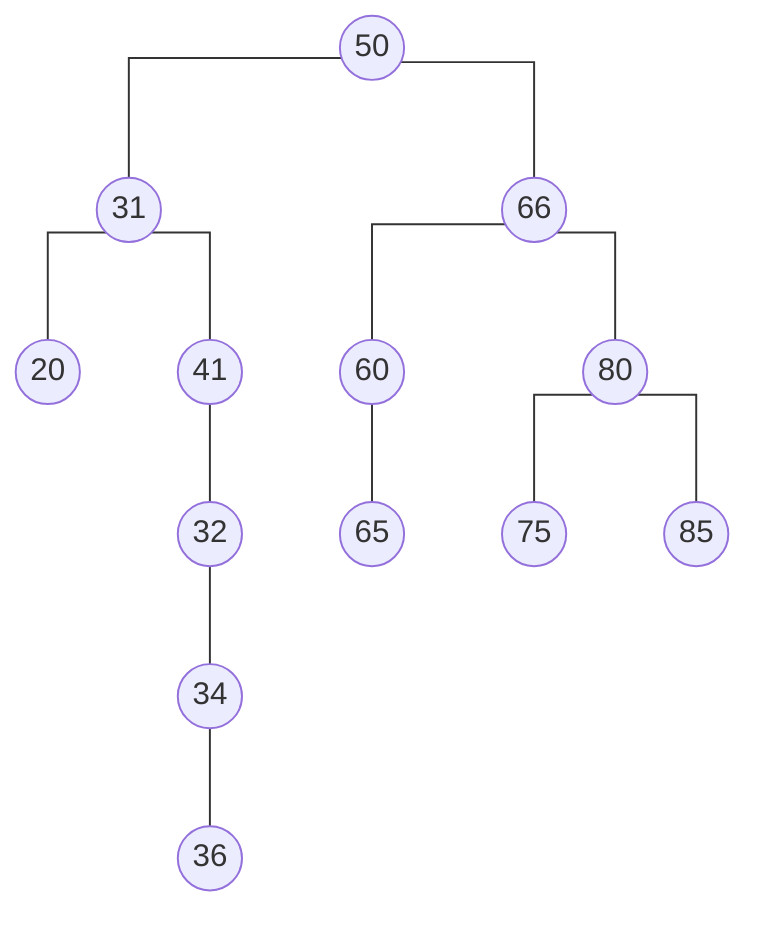
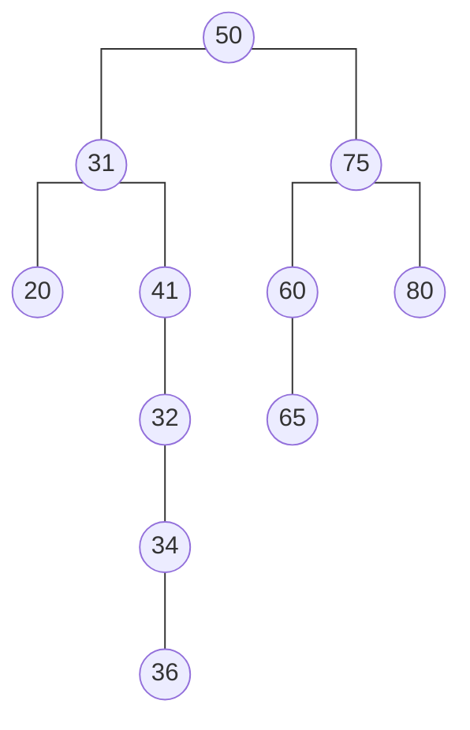

# binary search tree

<div style="text-align: justify">

* refer to sub-section 1.1 of [7-heaps_and_heapsort][def] to find out WTF a binary tree is

## 0. WTF is a binary search tree?
* abbr. BST
*  a type of binary tree where each node has at most two children (referred to as the *left child* and *right child*) and statisfies the *binary search property*
* TF is the binary search property?
    * glad you asked...
    * for any given node, all values in its left sub-tree are less than said node’s value and all values in its right sub-tree are greater than the node’s value
* keys in a BST are unique, that is, there are no duplicates in a BST
* the root node is the entry point into the BST
* each node typically contains a key, an associated value and pointers to its left and right children making it a flexible and efficient structure for dynamic data
* illustration below



* focus on root node
    * the keys of the nodes in its left sub-tree are lesser than its key, `50`
    * the keys of the nodes in its right sub-tree are greater than its key
* pick any non-leaf node; the nodes under it follow the same pattern
> **for the americans in the back**<br/> - a BST *is* a binary tree, however, it does not satisfy the heap property; it satisfies the binary search property instead <br/><br/>
### 0.1. where TF are BSTs useful?
* BSTs are useful when maintaining a sorted list of data is important as an in-order traversal (left, root, right) will yield the elements in ascending order
* are widely used in applications such as databases, file systems and implementing associative arrays or sets where ordered data access is required
    * examples: DNS look-ups use BSTs for cluster searching of domain names
* other situations where BSTs are useful
    * data dynamically grows or shrinks a lot
    * frequent searching is required
    * one needs to find the next greatest or smallest element
    * one needs to retrieve elements in a given range
## 1. implement a BST
* fundamental building block of a BST is a **node**
* TF is a node?
    * a data structure that stores data and maintains the BST’s structure
    * has the following
        * a key (and an optional value)
        * a reference/pointer to a left child (for smaller keys)
        * a reference/pointer to a right child (for larger keys)
    * the arrangement follows the BST property: all keys in the left sub-tree are ≤ the node’s key and all keys in the right sub-tree are > the node’s key
    * nodes without children are called leaf nodes
### 1.1. pseudo-code for a node
```plaintext
    class Node:
        declare integer, `key`
        declare Node, `left` and `right`

        Function Node(num):
            key = num
            left = null
            right = null
```
### 1.2. pseudo-code for BST
```plaintext
class BST:
    declare Node, `root` // see sub-section 1.1 above

    Function Search(target): // public (exposed to users)
        return search(target, root)
    
    Function search(target, node) // private
        if node is not NULL && node.key == target:
            return TRUE
        else if node is NULL:
            return FALSE
            
        if target < node.key:
            return search(target, node.left)
        else:
            return search(target, node.right)

        return FALSE 
    
    Function Insert(target): // public
        root = insert(root, target)
        return root
    
    Function insert(node, target): // private
        if node == NULL:
            return new Node(target)
        
        if target < node.key:
            node.left = insert(node.left, target)
        else if target > node.key:
            node.right = insert(node.right, target)
        
        return node
    
    Function Delete(target): // public
        return delete(root, target)
    
    Function delete(node, target): // private
        if node is NULL:
            return NULL
        
        // search for node to delete
        if target < node.key:
            node.left = delete(node.left, target)
        else if target > node.key:
            node.right = delete(node.right, target)
        else:
            if node.left == NULL: // cases 1 and 2
                return node.right
            else if node.right: // case 3
                return node.left
            successor = minValue(node.right)
            node.key = successor.key
            node.right = delete(node.right, successor.key)

        return node

    Function minValue(node):
        while node.left:
            node = node.left
        
        return node
    
```

## 2. the `search` method
* **steps**
    * start at athe root node
    * compare key of current node with target value
        * return `true` if key<sub>node<sub>i</sub></sub> = target
        * search the left sub-tree if target &lt; key<sub>node<sub>i</sub></sub> , else, search right sub-tree
    * return `false` if a leaf node is reached while the target has not been found
* **example**
    * target = 36 and the BST is the following

    ```mermaid
        %%{ init: { 'flowchart': { 'curve': 'stepAfter' } } }%%
        graph TD
            A((50)) --- B((31))
            A --- C((66))
            B --- D((20))
            B --- E((41))
            C --- F((60))
            C --- G((80))
            E --- H((32))
            H --- I((34))
            I --- J((36))
            F --- K((65))
            G --- L((75))
            G --- M((85))
    ```

    * step one: start at the root node
        * key = 50
    * step two: compare key of current node with target value
        * compare `50` with `36`
        * 36 &lt; 50, therefore, repeat steps with left child node
        * key = 31
        * compare `31` with `36`
        * 36 &gt; 31, therefore, repeat steps with right child node
        * key = 41
        * compare `41` with `36`
        * 36 &lt; 41, therefore, repeat steps with left child node
        * key = 32
        * compare `32` with `36`
        * 36 &gt; 32, therefore, repeat steps with right child node
        * key = 34
        * compare `34` with `36`
        * 36 &gt; 34, therefore, repeat steps with right child node
        * key = 36
        * compare `36` with `36`
        * 36 = 36; target found
        * return `true`
    
### 2.1. time complexity analysis
#### 2.1.1. worst case
* **worst-case** occurs when every node in the BST is compared to the target value
* example 1: target = 36 in the BST above
* example 2: a BST with the following nodes: {50, 66, 80, 85} and target = 85

    ```mermaid
        %%{ init: { 'flowchart': { 'curve': 'stepAfter' } } }%%
        graph TD
            A((50)) --- B((66))
            B --- C((80))
            C --- D((85))
    ```

* assumptions
    * there are `n` nodes in the BST
    * ~~there are `m` nodes between the root node and the node whose  key is equal to the target~~
    * ~~the height of the BST is `h`~~
* comparison op takes constant time; there are `n` nodes, therefore, it will take `n` long to traverse the BST
* **conclusion: the time complexity of the `search` method in the worst case is proportional to the number of nodes in the BST, that is,** <br/><br/> $T(n) \in O(n)$ <br/><br/>
#### 2.1.2. best case
* **best case** occurs when the key of the root node is equal to the target regardless of how large the BST is
* comparison op takes constant time; there is only one node to check, therefore, it takes constant time to find the target
* **conclusion: the time complexity of the `search` method in the best case is constant, that is,** <br/><br/> $T(n) \in O(1)$ <br/><br/>
#### 2.1.3. average case
* **average case** depends on the expected number of nodes compared, that is, <br/><br/> $T(n) \propto C(n)$ <br/><br/>
* assumptions
    * BST is randomly constructed and it has `n` nodes
    * said randomly constructed tree is **relatively** balanced and its height is `h` where `h = log(n)`
* there are two scenarios arising from said assumptions
    * unsuccessful search
    * successful search
* **unsuccessful search scenario**
    * recall: $C(n)$ is the expected number of comparisons (or expected depth of a BST)
    * $C(n)$ is unnecessary here because the entire depth of the tree will be traversed (recall: `search` returns `false` when it gets to a leaf node w/o finding the target)
    * comparison op takes constant time; each unsuccessful search takes as many comparisons as the height of the tree, therefore, it will take log(n) time to traverse the BST
    * **conclusion: the time complexity of an unsuccessful search using the `search` method in the average case is proportional to the height of the BST, that is,** <br/><br/> $T(n) \in O(log \ n)$ <br/><br/>
* **successful search scenario**
    * $C(n)$ is necessary because the target is not necessarily located in a leaf node
    * random variable: `i`
        * let `i` be the number of nodes in the left sub-tree of the current node (the *"current node"* is the node whose key we are comparing to the target at the moment)
        * recall: there are `n` nodes in the BST, therefore, the right sub-tree has `n-i-1` nodes (minus one because we are sitting on a node, that is, the left and right sub-trees must be connected to a node)
    * probability
        * each node has an equal chance of being compared to the target based on the assumptions above
        * there are `n` nodes, `i` of which are on the left of the current one at any given time
        * the probability that search algo goes to the left sub-tree *viz* <br/><br/> $\text{P(nodes on the left sub-tree are compared to target)}  = \frac{i}{n}$ <br/><br/> trivially, the probability that search algo goes to the right sub-tree is <br/><br/> $\text{P(nodes on the right sub-tree are compared to target)}  = \frac{n - i - 1}{n}$ <br/><br/>
    * the recurrence relation is given by <br/><br/> $C(n) = 1 + \sum_{i=0}^{n-1}(\frac{i}{n} C(i) + \frac{(n - i - 1)}{n} C(n - i - 1))$ <br/><br/> **where**<br/> - $C(n)$ is the expected number of comparisons at the root <br/> - `1` represents a single comparison between the key of the root node and the target <br/> - the summation expression represents the **expected** number of comparisons in the next step <br/><br/> **use the assumptions above to simplify the expression** <br/> assumption one: tree is more-or-less balanced <br/> use this assumption to deduce that there are more-or-less equal nodes on either side of the current node and that the comparisons on the left sub-tree are more-or-less equal to those on the right <br/> $\frac{i}{n} \approx \frac{(n - i - 1)}{n}$  <br/>and  $C(i) \approx C(n - i - 1)$ <br/><br/> $C(n) \approx 1 + \frac{2}{n} \sum_{i=0}^{n-1}(C(i))$ <br/><br/> **use the continuous approximation of the expected value over all possible sub-tree sizes to replace the summation item then use the differential equation form and integrate both sides** <br/><br/> $C(n) \approx 1 +  \frac{2}{n}\int_{0}^{n} C(x) \ dx$ <br/><br/> $C'(n) \approx \frac{2}{n} C(n)$ <br/> and $\frac{dC}{C} = \frac{2}{n} dn$  <br/><br/> $\text{ln} \ C(n) = 2 \ \text{ln} \ n + C_1$ <br/><br/> **exponentiate both sides of the expression** <br/> $C(n) = e^{C_1} n^2$ we can express $C(n)$ as $2 \ \text{ln} \ n$ plus a constant that is not $C_1$<br/><br/> $C(n) = 2 \ \text{ln} \ n + C_2$ where $C_2 \neq C_1$<br/><br/> $\text{ln}(n) = log_2(n) \times \text{ln}(2)$ (natural log and base two log are asymptotically equivalent, that is, they grow at the same rate) <br/> and use $O(1)$ to approximate $C_2$ <br/><br/> $\therefore \ C(n) \approx 2 \ \text{ln}(n) \mp O(1) \approx 1.39 \ log_2(n)$
    * **conclusion: the time complexity of a successful search using the `search` method in the average case is proportional to the height of the BST, that is,** <br/><br/> $T(n) \in O(log \ n)$ <br/><br/>
#### 2.1.4. conclusion
* **best case**
    * the time complexity of the `search` method in the best case is constant, that is, <br/><br/> $T(n) \in O(1)$ <br/><br/>
* **worst case**
    * the time complexity of the `search` method in the worst case is proportional to the number of nodes in the BST, that is, <br/><br/> $T(n) \in O(n)$ <br/><br/>
* **average case**
    * the time complexity of an **unsuccessful** search using the `search` method in the average case is proportional to the height of the BST, that is, <br/><br/> $T(n) \in O(log \ n)$ <br/><br/>
    * the time complexity of a **successful** search using the `search` method in the average case is proportional to the height of the BST, that is, <br/><br/> $T(n) \in O(log \ n)$ <br/><br/>

## 3. the `insert` method
* **steps**
    * start at the root node
    * compare key of current node with target value
        * explore the left sub-tree if target &lt; key<sub>node<sub>i</sub></sub> , else, explore right sub-tree
        * stop gracefully if key<sub>node<sub>i</sub></sub> = target (recall: there can be no duplicates in a BST)
    * insert a new node at `null` position when a leaf node or `null` position is reached
* **example**
    * target = 35 and the BST is the following

    ```mermaid
        %%{ init: { 'flowchart': { 'curve': 'stepAfter' } } }%%
        graph TD
            A((50)) --- B((31))
            A --- C((66))
            B --- D((20))
            B --- E((41))
            C --- F((60))
            C --- G((80))
            E --- H((32))
            H --- I((34))
            I --- J((36))
            F --- K((65))
            G --- L((75))
            G --- M((85))
    ```

    * step one: start at the root node
        * key = 50
    * step two: compare key of current node with target value
        * compare `50` with `35`
        * 35 &lt; 50, therefore, repeat steps with left child node
        * key = 31
        * compare `31` with `35`
        * 35 &gt; 31, therefore, repeat steps with right child node
        * key = 41
        * compare `41` with `35`
        * 35 &lt; 41, therefore, repeat steps with left child node
        * key = 32
        * compare `32` with `35`
        * 35 &gt; 32, therefore, repeat steps with right child node
        * key = 34
        * compare `34` with `35`
        * 35 &gt; 34, therefore, repeat steps with right child node
        * key = 36
        * compare `36` with `35`
        * 35 &lt; 36, therefore, repeat steps with right child node
        * key = `null` (we have reached a leaf node); must insert at previous node's left or right
            * 35 &lt; 36, therefore, point previous node's `left` to a new node with key `35`

    ```mermaid
        %%{ init: { 'flowchart': { 'curve': 'stepAfter' } } }%%
        graph TD
            A((50)) --- B((31))
            A --- C((66))
            B --- D((20))
            B --- E((41))
            C --- F((60))
            C --- G((80))
            E --- H((32))
            H --- I((34))
            I --- J((36))
            F --- K((65))
            G --- L((75))
            G --- M((85))
            J --- N((35))
    ``` 

### 3.1. time complexity analysis
#### 3.1.1. worst case
* **worst case** occurs when every node in the BST is compared to the target value
    * see the example above
* assumptions
    * there are `n` nodes in the BST
* comparison op takes constant time; there are `n` nodes, therefore, it will take `n` long to traverse the BST
* **conclusion: the time complexity of the `insert` method in the worst case is proportional to the number of nodes in the BST, that is,** <br/><br/> $T(n) \in O(n)$ <br/><br/>
#### 3.1.2. best case
* **best case** occurs when the new node is inserted in one step
    * example: it takes one step to make a node with key `52` in the BST above the right child of the root node
* comparison op takes constant time; there is only one node to check, therefore, it takes constant time to find the target
* **conclusion: the time complexity of the `insert` method in the best case is constant, that is,** <br/><br/> $T(n) \in O(1)$ <br/><br/>
#### 3.1.3. average case
* **average case** depends on the expected number of nodes compared, that is, <br/><br/> $T(n) \propto C(n)$ <br/><br/>
* assumptions
    * BST is randomly constructed and it has `n` nodes
    * said randomly constructed tree is **relatively** balanced and its height is `h` where `h = log(n)`
* the recurrence relation is given by <br/><br/> $C(n) = 1 + \sum_{i=0}^{n-1}(\frac{i}{n} C(i) + \frac{(n - i - 1)}{n} C(n - i - 1))$ <br/><br/> **where**<br/> - $C(n)$ is the expected number of comparisons at the root <br/> - `1` represents a single comparison between the key of the root node and the target <br/> - the summation expression represents the **expected** number of comparisons in the next step <br/><br/>
> **muhimu tena sana!** <br/> - the assumptions and calculations made in this scenario follow those of a **successful** search in the average case <br/> - **see sub-section 2.1.3 above** <br/><br/> $C(n) \approx 2 \ \text{ln}(n) \mp O(1) \approx 1.39 \ log_2(n)$ <br/><br/>
* **conclusion the time complexity of  the `insert` method in the average case is proportional to the height of the BST, that is, <br/><br/> $T(n) \in O(log \ n)$ <br/><br/>**
#### 3.1.4. conclusion
* **best case**
    * the time complexity of the `insert` method in the best case is constant, that is, <br/><br/> $T(n) \in O(1)$ <br/><br/>
* **worst case**
    * the time complexity of the `insert` method in the worst case is proportional to the number of nodes in the BST, that is, <br/><br/> $T(n) \in O(n)$ <br/><br/>
* **average case**
    * the time complexity of the `insert` method in the average case is proportional to the height of the BST, that is, <br/><br/> $T(n) \in O(log \ n)$ <br/><br/>

## 4. the `delete` method
* there are three scenarios when deleting a node from a BST
    * case one: target node is a leaf node
    * case two: target node has one child
    * case three: target node has two children
### 4.1. case one: target node is a leaf node
* deletion op is trivial: set the parent's reference to target node to `null`
* **example**
    * target = 36 and the BST is the following

    ```mermaid
        %%{ init: { 'flowchart': { 'curve': 'stepAfter' } } }%%
        graph TD
            A((50)) --- B((31))
            A --- C((66))
            B --- D((20))
            B --- E((41))
            C --- F((60))
            C --- G((80))
            E --- H((32))
            H --- I((34))
            I --- J((36))
            F --- K((65))
            G --- L((75))
    ```

    * step one: locate the node whose key is the target
    * step two: set the target's reference to said target to null
        * target = `Node(36)`
        * parent = `Node(34)`; target is parent's `right` reference
        * set `Node(34)`'s `right` reference to `null`

            ```plaintext
                Node {
                    val: 34
                    left: null
                    right: null
                }
            ```

    * BST *viz*

     ```mermaid
        %%{ init: { 'flowchart': { 'curve': 'stepAfter' } } }%%
        graph TD
            A((50)) --- B((31))
            A --- C((66))
            B --- D((20))
            B --- E((41))
            C --- F((60))
            C --- G((80))
            E --- H((32))
            H --- I((34))
            F --- K((65))
            G --- L((75))
    ```

    > **important!** <br/><br/> - node `36` will be in memory until the next clean-up/garbage collection <br/> - collection may be automatic or manual (`free` method in C, for example) <br/><br/>
### 4.2. case two: target node has one child
* replace the target node with its only child by adjusting the parent's refeence to by-pass the node
    * set parent's reference to the target's child
* **example**
    * target = 34 and the BST is the following

    ```mermaid
        %%{ init: { 'flowchart': { 'curve': 'stepAfter' } } }%%
        graph TD
            A((50)) --- B((31))
            A --- C((66))
            B --- D((20))
            B --- E((41))
            C --- F((60))
            C --- G((80))
            E --- H((32))
            H --- I((34))
            I --- J((36))
            F --- K((65))
            G --- L((75))
    ```

    * step one: locate the node whose key is the target
    * step two: set parent's reference to the target's child
        * target = `Node(34)`
        * parent = `Node(32)`; target is parent's `right` reference
        * child = `Node(36)`; target is parent's `right` reference
            * `Node(36)` will be `Node(32)`'s `right` reference
        * set `Node(32)`'s `right` reference to `Node(36)`

            ```plaintext
                Node {
                    val: 32
                    left: null
                    right: Node(36)
                }
            ```

    * BST *viz*

     ```mermaid
        %%{ init: { 'flowchart': { 'curve': 'stepAfter' } } }%%
        graph TD
            A((50)) --- B((31))
            A --- C((66))
            B --- D((20))
            B --- E((41))
            C --- F((60))
            C --- G((80))
            E --- H((32))
            H --- J((36))
            F --- K((65))
            G --- L((75))
    ```

    > **important!** <br/><br/> - node `34` will be in memory until the next clean-up/garbage collection <br/><br/>
### 4.3. case three: target node has two children
* find the *in-order* successor or predecessor
    * *in-order* successor is the smallest node in the right sub-tree
        * right &rarr; left &rarr; left (keep left until you get to a node with no left child)
    * *in-order* predecessor is the largest node in the left sub-tree
        * left &rarr; right &rarr; right (keep right until you get to a node with no right child)
* copy said successor or predecessor's value to the target node
* delete said *in-order* successor or predecessor
* **example 1**
    * target = 66 and the BST is the following

    ```mermaid
        %%{ init: { 'flowchart': { 'curve': 'stepAfter' } } }%%
        graph TD
            A((50)) --- B((31))
            A --- C((66))
            B --- D((20))
            B --- E((41))
            C --- F((60))
            C --- G((80))
            E --- H((32))
            H --- I((34))
            I --- J((36))
            F --- K((65))
            G --- L((75))
    ```

    * step one: locate the node whose key is the target
    * step two: find the *in-order* successor or predecessor
        * **in-order successor** is `75`
        * **in-order predecessor** is `65`
        * pick whichever you like; here we will pick `75`
    * step three: copy said successor or predecessor's value to the target node

    ```mermaid
        %%{ init: { 'flowchart': { 'curve': 'stepAfter' } } }%%
        graph TD
            A((50)) --- B((31))
            A --- C((75))
            B --- D((20))
            B --- E((41))
            C --- F((60))
            C --- G((80))
            E --- H((32))
            H --- I((34))
            I --- J((36))
            F --- K((65))
            G --- L((75))
    ```
    
    * step four: delete said successor or predecessor
        * case one deletion since `75` is a leaf node

    ```mermaid
        %%{ init: { 'flowchart': { 'curve': 'stepAfter' } } }%%
        graph TD
            A((50)) --- B((31))
            A --- C((75))
            B --- D((20))
            B --- E((41))
            C --- F((60))
            C --- G((80))
            E --- H((32))
            H --- I((34))
            I --- J((36))
            F --- K((65))
    ```

* **example 2**
    * target = 31 and the BST is the following

    ```mermaid
        %%{ init: { 'flowchart': { 'curve': 'stepAfter' } } }%%
        graph TD
            A((50)) --- B((31))
            A --- C((66))
            B --- D((20))
            B --- E((41))
            C --- F((60))
            C --- G((80))
            E --- H((32))
            H --- I((34))
            I --- J((36))
            F --- K((65))
            G --- L((75))
    ```

    * step one: locate the node whose key is the target
    * step two: find the *in-order* successor or predecessor
        * **in-order successor** is `32`
        * **in-order predecessor** is `20`
        * pick whichever you like; here we will pick `32`
    * step three: copy said successor or predecessor's value to the target node

    ```mermaid
        %%{ init: { 'flowchart': { 'curve': 'stepAfter' } } }%%
        graph TD
            A((50)) --- B((32))
            A --- C((66))
            B --- D((20))
            B --- E((41))
            C --- F((60))
            C --- G((80))
            E --- H((32))
            H --- I((34))
            I --- J((36))
            F --- K((65))
            G --- L((75))
    ```
    
    * step four: delete said successor or predecessor
        * case two deletion since `32` is a node with one child

    ```mermaid
        %%{ init: { 'flowchart': { 'curve': 'stepAfter' } } }%%
        graph TD
            A((50)) --- B((32))
            A --- C((66))
            B --- D((20))
            B --- E((41))
            C --- F((60))
            C --- G((80))
            E --- I((34))
            I --- J((36))
            F --- K((65))
            G --- L((75))
    ```

> **successor vs predecessor choice** <br/><br/> - no strict rule mandates one over the other; both maintain BST order since the successor exceeds the target and the predecessor falls below it <br/> - use the in-order successor when implementations or conventions favour it (example: LeetCode problem 450 where going right then left minimises code changes for many standard recursive deletion algorithms) <br/> - use  the in-order predecessor symmetrically when the left subtree is shallower or to balance traversal depth <br/> - there is no strict/significant performance difference in average case based on your choice <br/><br/>

### 4.4. time complexity
#### 4.4.1. worst case
* **worst case** occurs when every node in the BST is compared to the target value
* assumptions
    * there are `n` nodes in the BST
* comparison op takes constant time; there are `n` nodes, therefore, it will take `n` long to traverse the BST
* **conclusion: the time complexity of the `delete` method in the worst case is proportional to the number of nodes in the BST, that is,** <br/><br/> $T(n) \in O(n)$ <br/><br/>
#### 4.4.2. best case
* **best case** occurs when the target node is deleted in one step
    * example: it takes one step to delete a root node in a BST that has two nodes in total
* assumptions
    * the search op takes relatively constant time
* comparison op takes constant time; there is only one node to check, therefore, it takes constant time to find the target
* **conclusion: the time complexity of the `delete` method in the best case is constant, that is,** <br/><br/> $T(n) \in O(1)$ <br/><br/>
#### 4.4.3. average case
* **average case** depends on the expected number of nodes compared, that is, <br/><br/> $T(n) \propto C(n)$ <br/><br/>
* assumptions
    * BST is randomly constructed and it has `n` nodes
    * said randomly constructed tree is **relatively** balanced and its height is `h` where `h = log(n)`
* the recurrence relation is given by <br/><br/> $C(n) = 1 + \sum_{i=0}^{n-1}(\frac{i}{n} C(i) + \frac{(n - i - 1)}{n} C(n - i - 1))$ <br/><br/> **where**<br/> - $C(n)$ is the expected number of comparisons at the root <br/> - `1` represents a single comparison between the key of the root node and the target <br/> - the summation expression represents the **expected** number of comparisons in the next step <br/><br/>
> ***muito* freaking *importante*!** <br/> - the assumptions and calculations made in this scenario follow those of a **successful** search in the average case <br/> - **see sub-section 2.1.3 above** <br/><br/> $C(n) \approx 2 \ \text{ln}(n) \mp O(1) \approx 1.39 \ log_2(n)$ <br/><br/>
* **conclusion the time complexity of  the `delete` method in the average case is proportional to the height of the BST, that is, <br/><br/> $T(n) \in O(log \ n)$ <br/><br/>**
#### 4.4.4. conclusion
* **best case**
    * the time complexity of the `delete` method in the best case is constant, that is, <br/><br/> $T(n) \in O(1)$ <br/><br/>
* **worst case**
    * the time complexity of the `delete` method in the worst case is proportional to the number of nodes in the BST, that is, <br/><br/> $T(n) \in O(n)$ <br/><br/>
* **average case**
    * the time complexity of the `delete` method in the average case is proportional to the height of the BST, that is, <br/><br/> $T(n) \in O(log \ n)$ <br/><br/>

## 5. in-order traversal
### 5.1. pseudo-code

```plaintext
    // assume type `Node` is already defined
    // assume a BST wose root is a variable, `root`, of type `Node` exists
    // see sub-section 1.2 above

    Function InOrderTraversal:
        if node == NULL;
            return
        
        InOrderTraversal(node.left)
        visit(node)
        InOrderTraversal(node.right)

    Function visit: // print key, append said key to an array etc...
        ...

    // call the function
    InOrderTraversal()
```

### 5.2. steps
* start at root node
* traverse left sub-tree recursively
* visit/process current node
* traverse right sub-tree recursively

### 5.3. example
* traverse the following BST and append the keys to an array



* have an empty array of size `n` where `n` is hte number of nodes in the BST
    * `n` = 13
    * array *viz*

    |key||||||||||||||
    |:---:|:---:|:---:|:---:|:---:|:---:|:---:|:---:|:---:|:---:|:---:|:---:|:---:|:---:|
    |idx|0|1|2|3|4|5|6|7|8|9|10|11|12|
* call `InOrderTraversal(50)`
    * call `InOrderTraversal(31)`
        * call `InOrderTraversal(20)`
            * call `visit(20)`
                * append key 20 to array
        * call `visit(31)`
            * append key 31 to array
    * call `InOrderTraversal(41)`
        * call `InOrderTraversal(32)`
            * call `visit(32)`
                * append key 32 to array
        * call `InOrderTraversal(34)`
            * call `visit(34)`
                * append key 34 to array
        * call `InOrderTraversal(36)`
            * call `visit(36)`
                * append key 36 to array
        * call `visit(41)`
            * append key 41 to array
    * call `visit(50)`
        * append key 50 to array
    * call `InOrderTraversal(66)`
        * call `InOrderTraversal(60)`
            * call `visit(60)`
                * append key 60 to array
        * call `InOrderTraversal(65)`
            * call `visit(65)`
                * append key 65 to array
        * call `visit(66)`
            * append key 66 to array
    * call `InOrderTraversal(80)`
        * call `InOrderTraversal(75)`
            * call `visit(75)`
                * append key 75 to array
        * call `InOrderTraversal(85)`
            * call `visit(85)`
                * append key 85 to array
        * call `visit(80)`
            * append key 80 to array
    * job done; array *viz*

    |key|20|31|32|34|36|41|50|60|65|66|75|80|85|
    |:---:|:---:|:---:|:---:|:---:|:---:|:---:|:---:|:---:|:---:|:---:|:---:|:---:|:---:|
    |idx|0|1|2|3|4|5|6|7|8|9|10|11|12|

> **in-order sorting creates a sorted (ascending order) array**
## 6. pre-order traversal
### 6.1. pseudo-code

```plaintext
    // assume type `Node` is already defined
    // assume a BST wose root is a variable, `root`, of type `Node` exists
    // see sub-section 1.2 above

    Function PreOrderTraversal:
        if node == NULL;
            return
        
        visit(node)
        PreOrderTraversal(node.left)
        PreOrderTraversal(node.right)

    Function visit: // print key, append said key to an array etc...
        ...

    // call the function
    PreOrderTraversal()
```

### 6.2. steps
* start at root node
* visit/process current node
* traverse left sub-tree recursively
* traverse right sub-tree recursively

### 6.3. example
* traverse the following BST and append the keys to an array


* have an empty array of size `n` where `n` is hte number of nodes in the BST
    * `n` = 13
    * array *viz*

    |key||||||||||||||
    |:---:|:---:|:---:|:---:|:---:|:---:|:---:|:---:|:---:|:---:|:---:|:---:|:---:|:---:|
    |idx|0|1|2|3|4|5|6|7|8|9|10|11|12|
* call `PreOrderTraversal(50)`
    * call `visit(50)`
        * append key 50 to array
    * call `PreOrderTraversal(31)`
        * call `visit(31)`
            * append key 31 to array
        * call `PreOrderTraversal(20)`
            * call `visit(20)`
                * append key 20 to array
    * call `PreOrderTraversal(41)`
        * call `visit(41)`
            * append key 41 to array
        * call `PreOrderTraversal(32)`
            * call `visit(32)`
                * append key 32 to array
        * call `PreOrderTraversal(34)`
            * call `visit(34)`
                * append key 34 to array
        * call `PreOrderTraversal(36)`
            * call `visit(36)`
                * append key 36 to array
    * call `PreOrderTraversal(66)`
        * call `visit(66)`
            * append key 66 to array
        * call `PreOrderTraversal(60)`
            * call `visit(60)`
                * append key 60 to array
        * call `PreOrderTraversal(65)`
            * call `visit(65)`
                * append key 65 to array
    * call `PreOrderTraversal(80)`
        * call `visit(80)`
            * append key 80 to array
        * call `PreOrderTraversal(75)`
            * call `visit(75)`
                * append key 75 to array
        * call `PreOrderTraversal(85)`
            * call `visit(85)`
                * append key 85 to array
    * job done; array *viz*

    |key|50|31|20|41|32|34|36|60|66|60|80|75|85|
    |:---:|:---:|:---:|:---:|:---:|:---:|:---:|:---:|:---:|:---:|:---:|:---:|:---:|:---:|
    |idx|0|1|2|3|4|5|6|7|8|9|10|11|12|           
    
> **useful when you need to capture the tree structure for later reconstruction and/or process root-first tasks**

## 7. post-order traversal
### 7.1. pseudo-code

```plaintext
    // assume type `Node` is already defined
    // assume a BST wose root is a variable, `root`, of type `Node` exists
    // see sub-section 1.2 above

    Function PostOrderTraversal:
        if node == NULL;
            return
        
        PostOrderTraversal(node.left)
        PostrderTraversal(node.right)
        visit(node)

    Function visit: // print key, append said key to an array etc...
        ...

    // call the function
    PostrderTraversal()
```

### 7.2. steps
* start at root node
* traverse left sub-tree recursively
* traverse right sub-tree recursively
* visit/process current node

### 7.3. example
* traverse the following BST and append the keys to an array


* have an empty array of size `n` where `n` is hte number of nodes in the BST
    * `n` = 13
    * array *viz*

    |key||||||||||||||
    |:---:|:---:|:---:|:---:|:---:|:---:|:---:|:---:|:---:|:---:|:---:|:---:|:---:|:---:|
    |idx|0|1|2|3|4|5|6|7|8|9|10|11|12|
* call `PostOrderTraversal(50)`
    * call `PostOrderTraversal(31)`
        * call `PostOrderTraversal(20)`
            * call `visit(20)`
                * append key 20 to array
            * call `PostOrderTraversal(41)`
                * call `PostOrderTraversal(32)`
                    * call `PostOrderTraversal(34)`
                        * call `PostOrderTraversal(36)`
                            * call `visit(36)`
                                * append key 36 to array
                        * call `visit(34)`
                            * append key 34 to array
                    * call `visit(32)`
                        * append key 32 to array
                * call `visit(41)`
                    * append key 41 to array
            * call `visit(31)`
                * append key 31 to array   
    * call `PostOrderTraversal(66)`
        * call `PostOrderTraversal(60)`
            * call `PostOrderTraversal(65)`
                * call `visit(65)`
                    * append key 65 to array
            * call `visit(60)`
                * append key 60 to array 
        * call `PostOrderTraversal(80)`
            * call `PostOrderTraversal(75)`
                * call `visit(75)`
                    * append key 75 to array
            * call `PostOrderTraversal(85)`
                * call `visit(85)`
                    * append key 85 to array
            * call `visit(80)`
                * append key 80 to array   
        * call `visit(66)`
            * append key 66 to array
    * call `visit(50)`
            * append key 50 to array
    * job done; array *viz*

    |key|20|36|34|32|41|31|65|60|75|85|80|66|50|
    |:---:|:---:|:---:|:---:|:---:|:---:|:---:|:---:|:---:|:---:|:---:|:---:|:---:|:---:|
    |idx|0|1|2|3|4|5|6|7|8|9|10|11|12|  

> **useful for tear-down and/or bottom-up tasks**

## 8. time complexity of traversal methods
* is the same regardless of method because algo needs to visit all the nodes once and only once
    * node look-up takes constant time; there are `n` nodes, therefore, it will take `n` long to traverse the BST
* **conclusion: the time complexity of the any method in the worst, best and average case is proportional to the number of nodes in the BST, that is,** <br/><br/> $T(n) \in O(n)$ <br/><br/>


</div>

[def]: ./7-heaps_and_heapsort.md