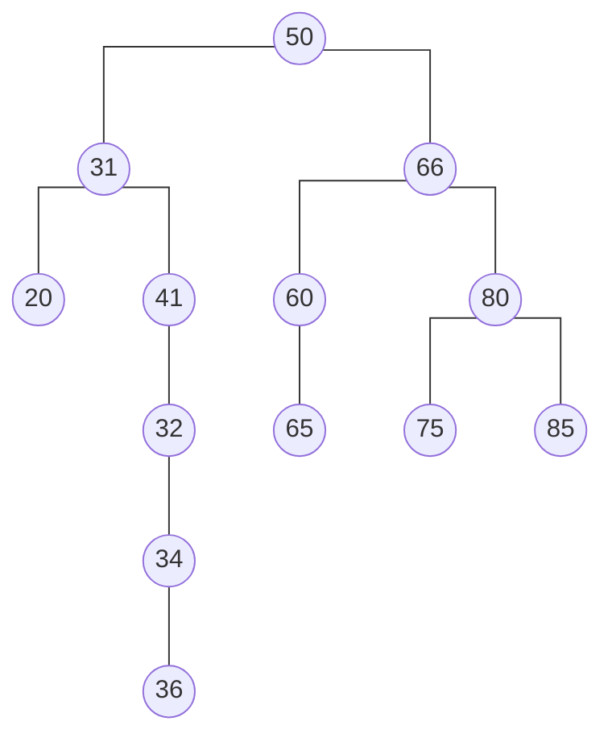

# binary search tree

<div style="text-align: justify">

* refer to sub-section 1.1 of [7-heaps_and_heapsort][def] to find out WTF a binary tree is

## 0. WTF is a binary search tree?
* abbr. BST
*  a type of binary tree where each node has at most two children (referred to as the *left child* and *right child*) and statisfies the *binary search property*
* TF is the binary search property?
    * glad you asked...
    * for any given node, all values in its left sub-tree are less than said node’s value and all values in its right sub-tree are greater than the node’s value
* keys in a BST are unique, that is, there are no duplicates in a BST
* thr root node is the entry point into the BST
* each node typically contains a key, an associated value and pointers to its left and right children making it a flexible and efficient structure for dynamic data
* illustration below



* focus on root node
    * the keys of the nodes in its left sub-tree are lesser than its key, `50`
    * the keys of the nodes in its right sub-tree are greater than its key
* pick any non-leaf node; the nodes under it follow the same pattern
> **for the americans in the back**<br/> - a BST *is* a binary tree, however, it does not satisfy the heap property; it satisfies the binary search property instead <br/><br/>
### 0.1. where TF are BSTs useful?
* BSTs are useful when maintaining a sorted list of data is important as an in-order traversal (left, root, right) will yield the elements in ascending order
* are widely used in applications such as databases, file systems and implementing associative arrays or sets where ordered data access is required
    * examples: DNS look-ups use BSTs for cluster searching of domain names
* other situations where BSTs are useful
    * data dynamically gows or shrinks a lot
    * frequent searching is required
    * one needs to find the next greatest or smallest element
    * one needs to retrieve elements in a given range
## 1. implement a BST
* fundamental building block of a BST is a **node**
* TF is a node?
    * a data structure that stores data and maintains the BST’s structure
    * has the following
        * a key (and an optional value)
        * a reference/pointer to a left child (for smaller keys)
        * a reference/pointer to a right child (for larger keys)
    * the arrangement follows the BST property: all keys in the left sub-tree are ≤ the node’s key and all keys in the right sub-tree are > the node’s key
    * nodes without children are called leaf nodes
### 1.1. pseudo-code for a node
```plaintext
    class Node:
        declare integer, `val`
        declare Node, `left` and `right`

        Function Node(num):
            val = num
            left = null
            right = null
```
### 1.2. pseudo-code for BST
```plaintext
class BST:
    declare Node, `root` // see sub-section 1.1 above

    Function Search(target): // public (exposed to users)
        return search(target, root)
    
    Function search(target, node) // private
        if node is not NULL && node.key == target:
            return TRUE
        else if node is NULL:
            return FALSE
            
        if target < node.key:
            return search(target, node.left)
        else:
            return search(target, node.right)

        return FALSE 
    
    Function Insert(target):
        ...
    
    Function Delete(target):
        ...
    
```

## 2. the `search` method
* **steps**
    * start at athe root node
    * compare key of current node with target value
        * return `true` if key<sub>node<sub>i</sub></sub> = target
        * search the left sub-tree if target &lt; key<sub>node<sub>i</sub></sub> , else, search right sub-tree
    * return `false` if a leaf node is reached while the target has not been found
* **example**
    * target = 36 and the BST is the following

    ```mermaid
        %%{ init: { 'flowchart': { 'curve': 'stepAfter' } } }%%
        graph TD
            A((50)) --- B((31))
            A --- C((66))
            B --- D((20))
            B --- E((41))
            C --- F((60))
            C --- G((80))
            E --- H((32))
            H --- I((34))
            I --- J((36))
            F --- K((65))
            G --- L((75))
            G --- M((85))
    ```

    * step one: start at the root node
        * key = 50
    * step two: compare key of current node with target value
        * compare `50` with `36`
        * 36 &lt; 50, therefore, repeat steps with left child node
        * key = 31
        * compare `31` with `36`
        * 36 &gt; 31, therefore, repeat steps with right child node
        * key = 41
        * compare `41` with `36`
        * 36 &lt; 41, therefore, repeat steps with left child node
        * key = 32
        * compare `32` with `36`
        * 36 &gt; 32, therefore, repeat steps with right child node
        * key = 34
        * compare `34` with `36`
        * 36 &gt; 34, therefore, repeat steps with right child node
        * key = 36
        * compare `36` with `36`
        * 36 = 36; target found
        * return `true`
    
### 2.1. time complexity analysis
* **worst-case** occurs when every node in the BST is compared to the target value
    * example 1: target = 36 in the BST above
    * example 2: a BST with the following nodes: {50, 66, 80, 85} and target = 85

        ```mermaid
            %%{ init: { 'flowchart': { 'curve': 'stepAfter' } } }%%
            graph TD
                A((50)) --- B((66))
                B --- C((80))
                C --- D((85))
        ```

    * assumptions
        * there are `n` nodes in the BST
        * ~~there are `m` nodes between the root node and the node whose  key is equal to the target~~
        * ~~the height of the BST is `h`~~
    * comparison op takes constant time; there are `n` nodes, therefore, it will take `n` long to traverse the BST
    * **conclusion: the time complexity of the `search` method in the worst case is proportional to the number of nodes in the BST, that is,** <br/><br/> $T(n) \in O(n)$ <br/><br/>
* **best case** occurs when the key of the root node is equal to the target regardless of how large the BST is
    * comparison op takes constant time; there is only one node to check, therefore, it takes constant time to find the target
    * **conclusion: the time complexity of the `search` method in the best case is constant, that is,** <br/><br/> $T(n) \in O(1)$ <br/><br/>
* **average case** depends on the expected number of nodes compared, that is, <br/><br/> $T(n) \propto C(n)$ <br/><br/>
    * assumptions
        * BST is randomly constructed and it has `n` nodes
        * said randomly constructed tree is **relatively** balanced and its height is `h` where `h = log(n)`
    * there are two scenarios arising from said assumptions
        * unsuccessful search
        * successful search
    * **unsuccessful search scenario**
        * recall: $C(n)$ is the expected number of comparisons (or expected depth of a BST)
        * $C(n)$ is unnecessary here because the entire depth of the tree will be traversed (recall: `search` returns `false` when it gets to a leaf node w/o finding the target)
        * comparison op takes constant time; each unsuccessful search takes as many comparisons as the height of the tree, therefore, it will take log(n) time to traverse the BST
        * **conclusion:the time complexity of an unsuccessful search using the `search` method in the average case is proportional to the height of the BST, that is,** <br/><br/> $T(n) \in O(log \ n)$ <br/><br/>
    * **successful search scenario**
        * $C(n)$ is necessary because the target is not necessarily located in a leaf node
        * random variable: `i`
            * let `i` be the number of nodes in the left sub-tree of the current node (the *"current node"* is the node whose key we are comparing to the target at the moment)
            * recall: there are `n` nodes in the BST, therefore, the right sub-tree has `n-i-1` nodes (minus one because we are sitting on a node, that is, the left and right sub-trees must be connected to a node)
        * probability
            * each node has an equal chance of being compared to the target based on the assumptions above
            * there are `n` nodes, `i` of which are on the left of the current one at any given time
            * the probability that search algo goes to the left sub-tree *viz* <br/><br/> $\text{P(nodes on the left sub-tree are compared to target)}  = \frac{i}{n}$ <br/><br/> trivially, the probability that search algo goes to the right sub-tree is <br/><br/> $\text{P(nodes on the right sub-tree are compared to target)}  = \frac{n - i - 1}{n}$ <br/><br/>
        * the recurrence relation is given by <br/><br/> $C(n) = 1 + \sum_{i=0}^{n-1}(\frac{i}{n} C(i) + \frac{(n - i - 1)}{n} C(n - i - 1))$ <br/><br/> **where**<br/> - $C(n)$ is the expected number of comparisons at the root <br/> - `1` represents a single comparison between the key of the root node and the target <br/> - the summation expression represents the **expected** number of comparisons in the next step <br/><br/> **use the assumptions above to simplify the expression** <br/> assumption one: tree is more-or-less balanced <br/> use this assumption to deduce that there are more-or-less equal nodes on either side of the current node and that the comparisons on the left sub-tree are more-or-less equal to those on the right <br/> $\frac{i}{n} \approx \frac{(n - i - 1)}{n}$  <br/>and  $C(i) \approx C(n - i - 1)$ <br/><br/> $C(n) \approx 1 + \frac{2}{n} \sum_{i=0}^{n-1}(C(i))$ <br/><br/> **use the continuous approximation of the expected value over all possible sub-tree sizes to replace the summation item then use the differential equation form and integrate both sides** <br/><br/> $C(n) \approx 1 +  \frac{2}{n}\int_{0}^{n} C(x) \ dx$ <br/><br/> $C'(n) \approx \frac{2}{n} C(n)$ <br/> and $\frac{dC}{C} = \frac{2}{n} dn$  <br/><br/> $\text{ln} \ C(n) = 2 \ \text{ln} \ n + C_1$ <br/><br/> **exponentiate both sides of the expression** <br/> $C(n) = e^{C_1} n^2$ we can express $C(n)$ as $2 \ \text{ln} \ n$ plus a constant that is not $C_1$<br/><br/> $C(n) = 2 \ \text{ln} \ n + C_2$ where $C_2 \neq C_1$<br/><br/> $\text{ln}(n) = log_2(n) \times \text{ln}(2)$ (natural log and base two log are asymptotically equivalent, that is, they grow at the same rate) <br/> and use $O(1)$ to approximate $C_2$ <br/><br/> $ \therefore \ C(n) \approx 2 \ \text{ln}(n) \mp O(1) \approx 1.39 \ log_2(n)$
        * **conclusion:the time complexity of a successful search using the `search` method in the average case is proportional to the height of the BST, that is,** <br/><br/> $T(n) \in O(log \ n)$ <br/><br/>

* 5:10:51


</div>

[def]: ./7-heaps_and_heapsort.md