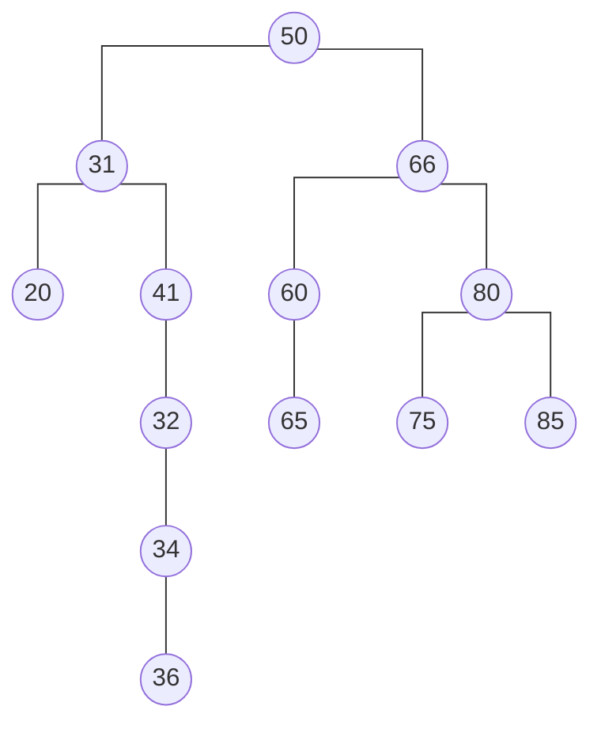

# binary search tree

<div style="text-align: justify">

* refer to sub-section 1.1 of [7-heaps_and_heapsort][def] to find out WTF a binary tree is

## 0. WTF is a binary search tree?
* abbr. BST
*  a type of binary tree where each node has at most two children (referred to as the *left child* and *right child*) and statisfies the *binary search property*
* TF is the binary search property?
    * glad you asked...
    * for any given node, all values in its left sub-tree are less than said node’s value and all values in its right sub-tree are greater than the node’s value
* keys in a BST are unique, that is, there are no duplicates in a BST
* thr root node is the entry point into the BST
* each node typically contains a key, an associated value and pointers to its left and right children making it a flexible and efficient structure for dynamic data
* illustration below



* focus on root node
    * the keys of the nodes in its left sub-tree are lesser than its key, `50`
    * the keys of the nodes in its right sub-tree are greater than its key
* pick any non-leaf node; the nodes under it follow the same pattern
> **for the americans in the back**<br/> - a BST *is* a binary tree, however, it does not satisfy the heap property; it satisfies the binary search property instead <br/><br/>
### 0.1. where TF are BSTs useful?
* BSTs are useful when maintaining a sorted list of data is important as an in-order traversal (left, root, right) will yield the elements in ascending order
* are widely used in applications such as databases, file systems and implementing associative arrays or sets where ordered data access is required
    * examples: DNS look-ups use BSTs for cluster searching of domain names
* other situations where BSTs are useful
    * data dynamically gows or shrinks a lot
    * frequent searching is required
    * one needs to find the next greatest or smallest element
    * one needs to retrieve elements in a given range
## 1. implement a BST
* fundamental building block of a BST is a **node**
* TF is a node?
    * a data structure that stores data and maintains the BST’s structure
    * has the following
        * a key (and an optional a value)
        * a reference/pointer to a left child (for smaller keys)
        * a reference/pointer to a right child (for larger keys)
    * the arrangement follows the BST property: all keys in the left sub-tree are ≤ the node’s key and all keys in the right sub-tree are > the node’s key
    * nodes without children are called leaf nodes
### 1.1. pseudo-code for a node
```plaintext
    class Node:
        declare integer, `val`
        declare Node, `left` and `right`

        Function Node(num):
            val = num
            left = null
            right = null
```
### 1.2. pseudo-code for BST
```plaintext
class BST:
    declare Node, `root` // see sub-section 1.1 above

    Function Search(target): // public (exposed to users)
        return search(target, root)
    
    Function search(target, node) // private
        if node is not NULL && node.key == target:
            return TRUE
            key = root.val
        else if node is NULL:
            return FALSE
            
        if target < node.key:
            return search(target, node.left)
        else:
            return search(target, node.right)

        return FALSE 
    
    Function Insert(target):
        ...
    
    Function Delete(target):
        ...
    
```

## the `search` method
* **steps**
    * start at athe root node
    * compare key of current node with target value
        * return `true` if key<sub>node<sub>i</sub></sub> = target
        * search the left sub-tree if target &lt; key<sub>node<sub>i</sub></sub> , else, search right sub-tree
    * return `false` if a leaf node is reached while the target has not been found
* **example**
    * target = 36 and the BSt is the following

    ```mermaid
        %%{ init: { 'flowchart': { 'curve': 'stepAfter' } } }%%
        graph TD
            A((50)) --- B((31))
            A --- C((66))
            B --- D((20))
            B --- E((41))
            C --- F((60))
            C --- G((80))
            E --- H((32))
            H --- I((34))
            I --- J((36))
            F --- K((65))
            G --- L((75))
            G --- M((85))
    ```

    * step one: start at the root node
        * key = 50
    * step two: compare key of current node with target value
        * compare `50` with `36`
        * 36 &lt; 50, therefore, repeat steps with left child node
        * key = 31
        * compare `31` with `36`
        * 36 &gt; 31, therefore, repeat steps with right child node
        * key = 41
        * compare `41` with `36`
        * 36 &lt; 41, therefore, repeat steps with left child node
        * key = 32
        * compare `32` with `36`
        * 36 &gt; 32, therefore, repeat steps with right child node
        * key = 34
        * compare `34` with `36`
        * 36 &gt; 34, therefore, repeat steps with right child node
        * key = 36
        * compare `36` with `36`
        * 36 = 36; target found
        * return `true`
    
* 5:00:11


</div>

[def]: ./7-heaps_and_heapsort.md